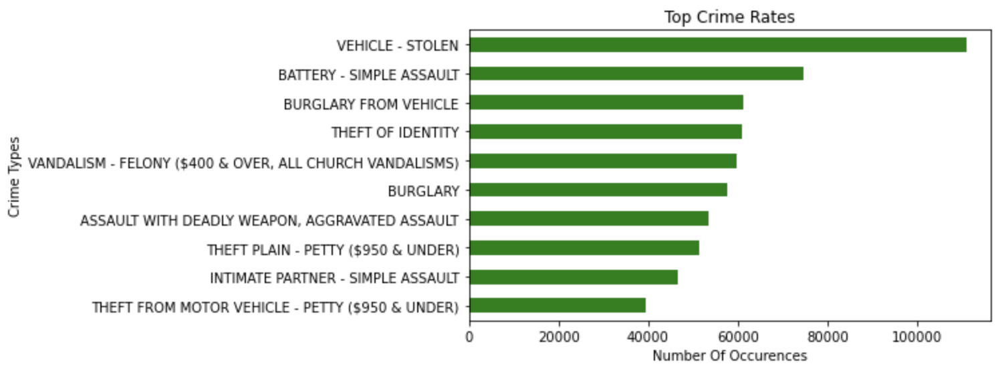

# 🕵️‍♂️ Crime Trend Analysis and Forecasting Using Los Angeles Crime Data (2020–2024)

## 🔍 Abstract

This project investigates crime patterns in Los Angeles from 2020 to 2024 using a dataset of over 900,000 crime records. The objective was to clean and structure the raw data, extract actionable insights, and forecast future trends. We applied statistical methods and time series forecasting (ARIMA) to identify crime hotspots, recurring offense types, and socioeconomic influences. The outcome supports policy planning, law enforcement decision-making, and public safety strategy through dashboards, KPIs, and executive-level summaries.

---

## 🚀 Project Features

- Engineered an analysis-ready dataset by imputing 5.4M+ missing values, removing duplicates, and converting timestamp formats for 100% completeness  
- Conducted exploratory data analysis with 15+ visualizations to reveal crime spikes, seasonal patterns, and regional differences  
- Identified “Stolen Vehicle” (110K cases) as the most frequent offense and Central Division as the highest-risk zone  
- Analyzed crime patterns by day of the week, uncovering Tuesdays as peak days for multiple offenses  
- Performed correlation analysis with 9 economic indicators, highlighting unemployment and poverty (ρ > 0.5) as key drivers of crime  
- Forecasted monthly crime rates using ARIMA (MAPE ≈ 7%), projecting a 15% decline and enabling proactive resource planning  
- Delivered insights through interactive dashboards and an executive presentation deck  

---

## 📊 Dataset Source

This project uses publicly available data from the Los Angeles Open Data Portal:  
🔗 [Crime Data from 2020 to Present](https://catalog.data.gov/dataset/crime-data-from-2020-to-present)

---

## 💻 Technologies Used

- **Python**: Core data processing and analysis  
- **Pandas & NumPy**: Data cleaning and transformation  
- **Matplotlib & Seaborn**: Visualizations and trend plotting  
- **Plotly** : Interactive charts  
- **Statsmodels / pmdarima**: Time series forecasting with ARIMA  
- **Jupyter Notebook**: Analysis and code development  
- **Excel**: Data formatting or supplemental analysis  
- **Git**: Version control and collaboration  

---

## 🖼️ Project Preview

### 🔹 Top 10 Crime Types in Los Angeles

> *Bar chart displaying the most frequent crimes reported from 2020 to 2023. 'Vehicle - Stolen' leads with over 110K cases, followed by various assault and theft categories.*

---

### 🔹 Crime Rates Across Los Angeles Regions

> *Comparative regional analysis reveals that the Central and 77th Street divisions have the highest reported crime counts, indicating potential hotspots for targeted policing.*

---

### 🔹 Crime Forecasting Using ARIMA

> *Time series forecasting predicts a ~15% decline in monthly crime incidents using ARIMA, with a 90% confidence interval for strategic law enforcement resource planning.*

---

